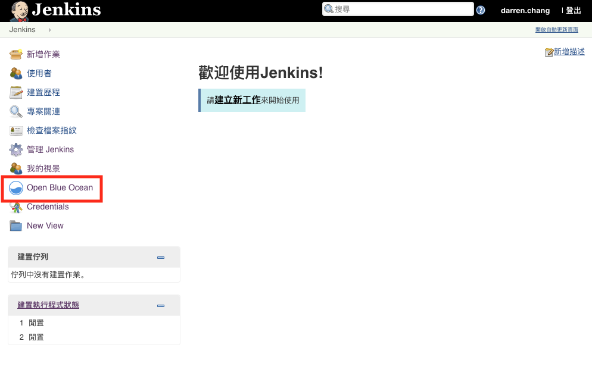
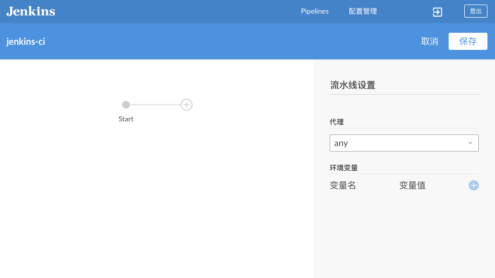
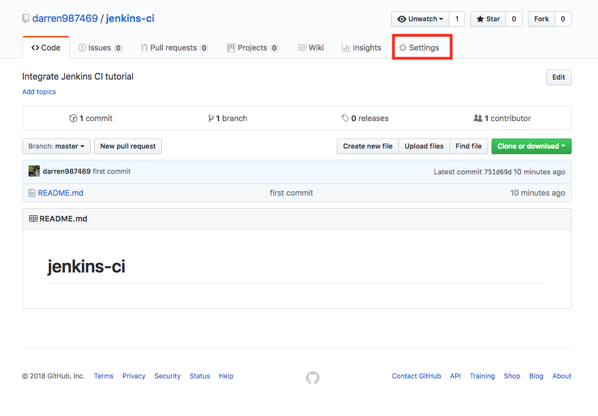
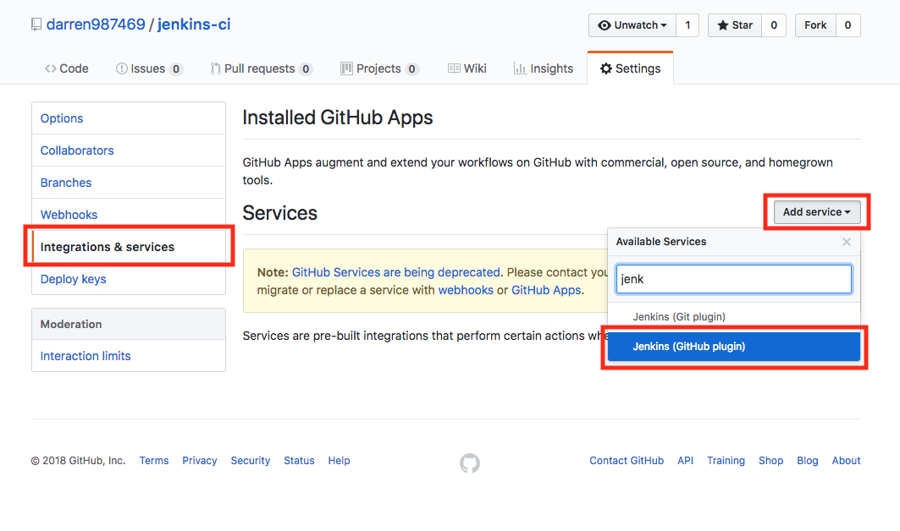
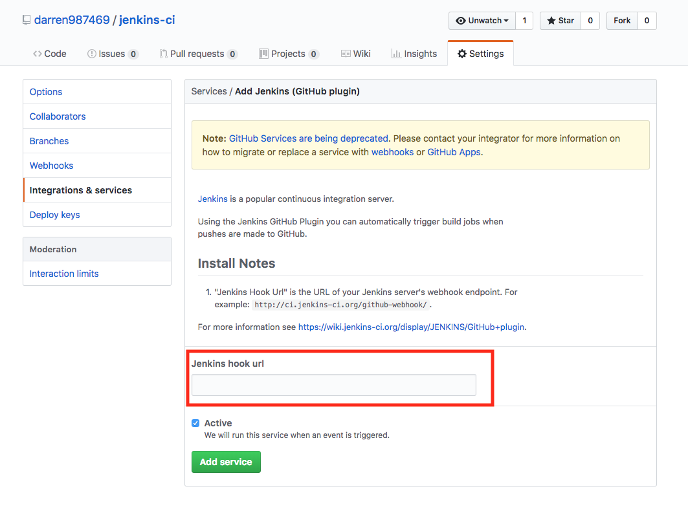

# jenkins-ci

## Create pipeline with Blue Ocean

In jenkins dashboard, click `Open Blue Ocean`



Click `Create New Pipeline` and follow the instructions. You can create/edit `Jenkinsfile` use Blue Ocean interface. If you want to create/edit `Jenkinsfile` with preferred editor, click `Cancel`.



Sample of `Jenkinsfile`

```Jenkinsfile
pipeline {
  agent any
  stages {
    stage('Build') {
      steps {
        echo 'This is the Build Stage'
      }
    }
    stage('Test') {
      steps {
        echo 'This is the Testing Stage'
      }
    }
    stage('Deploy') {
      steps {
        echo 'This is the Deploy Stage'
      }
    }
  }
}
```

## Setup jenkins service

In your repository, click `Settings`



Click `Integration & services` >> `Add service`. Select `Jenkins (Github plugin)`



Enter you jenkins hook url then click `Add service`



Note: If you run jenkins on localhost, you can use [ngrok](https://ngrok.com/) to setup the hook url.
