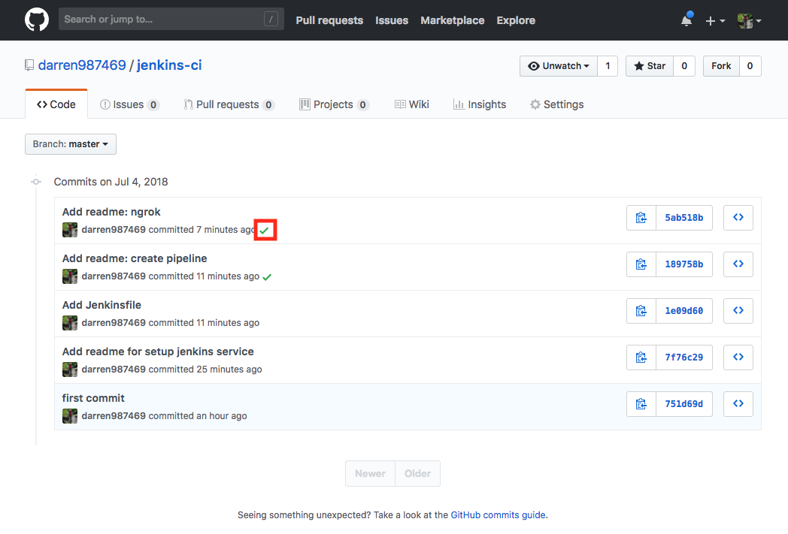

# jenkins-ci

## Create pipeline with Blue Ocean

In jenkins dashboard, click `Open Blue Ocean`


Click `Create New Pipeline` and follow the instructions. You can create/edit `Jenkinsfile` use Blue Ocean interface. If you want to create/edit `Jenkinsfile` with preferred editor, click `Cancel`.


Sample of `Jenkinsfile`

```Jenkinsfile
pipeline {
  agent any
  stages {
    stage('Build') {
      steps {
        echo 'This is the Build Stage'
      }
    }
    stage('Test') {
      steps {
        echo 'This is the Testing Stage'
      }
    }
    stage('Deploy') {
      steps {
        echo 'This is the Deploy Stage'
      }
    }
  }
}
```

## Setup jenkins service

In your repository, click `Settings`


Click `Integration & services` >> `Add service`. Select `Jenkins (Github plugin)`


Enter you jenkins hook url then click `Add service`


Note: If you run jenkins on localhost, you can use [ngrok](https://ngrok.com/) to setup the hook url.

Push the changes to github, and you can see green check in your commits. That means the commit pass your pipeline.



### Success PR

```sh
git checkout -b success_pr
echo 'success' >> README.md
git add .
git commit -m "Add readme"
git push -u origin success_pr
```


### Failure PR

```sh
git checkout -b failure_pr
```

Change Jenkinsfile

```Jenkinsfile
pipeline {
  agent any
  stages {
    stage('Build') {
      steps {
        // invalid command to let build fail
        sh 'ggcomand'
      }
    }
  }
}
```

```sh
git add .
git commit -m "Add broken commit"
git push -u origin failure_pr
```


